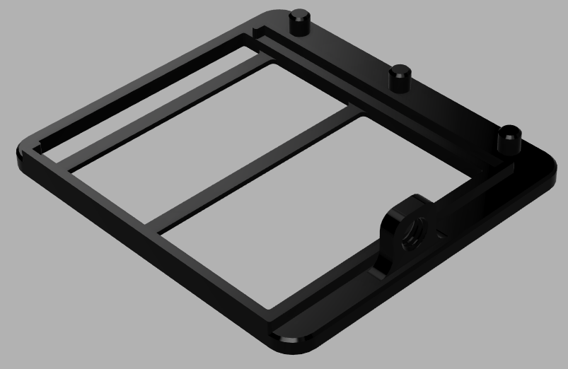

[日本語](./readme_ja.md)

# Interpupillary distance (IPD) adjustable Relativty

This is a [Relativty](https://github.com/relativty/Relativty) compatible HMD design for hackers and researchers.  
**The physical IPD is adjustable within 57~87mm left and right independently.**  
A top rail mount option is also available.

# Required components

Same as [Relativty](https://github.com/relativty/Relativty).  

|                                      Component                                      | Qty |
| :---------------------------------------------------------------------------------: | :-: |
|                   Fresnel lens(Diameter:42mm, Focal length:50mm)\*                  |  2  |
|              [Strap](https://www.aliexpress.com/item/33058848848.html)              |  1  |
|           [Face foam](https://www.aliexpress.com/item/4000199486058.html)           |  1  |
| [2 LCD panels with control board](https://www.aliexpress.com/item/32975198897.html) |  1  |

\*Their Fresnel lenses are sold out, but you may find a similar lens in Aliexpress.  

You also need to complete the build of the relativty motherboard when you want to use it with SteamVR or need 6DOF.

# 3D Printing

I optimized the 3D model for FDM (Fused Deposition Modeling) printers well.  
Therefore, **printing supports may not be required for this HMD model except for the face cover**.  
This HMD consists of three parts: HMD cover, and left and right eyeboxes.  
The following table shows the list of 3D printed components (rows 1-3: HMD cover, rows 4-6: Eyebox).

|                      Model                      | Qty |     |                      Model                     | Qty |
| :---------------------------------------------: | :-: | :-: | :--------------------------------------------: | :-: |
|          Top cover         |  1  |     |      Bottom cover      |  1  |
|      Face cover      |  1  |     |    L/R separator    |  1  |
|  Side strap holder |  2  |     |  Top strap holder  |  1  |
|    Lens mounter    |  2  |     |      Eyebox pillar     |  2  |
| Right display mounter |  1  |     | Left display mounter |  1  |
|      Eyebox screw\*      |  2  |     |                                                |     |

\*You can use general M6 screws instead of the 3D printed eyebox screw if you want.

## If you really like rail mount

I prepared a special top cover.  
Please print `./stl/Top_rail.stl` instead of `./stl/Top.stl`.  
The cross-section of the rail is as follows (unit:mm):  

# Assembly

No special tools are required, but if you have hot glues, you can attach the form into the face cover easily.

## Eyebox

Insert LCD panels into the display mounters at first.  
**The LCD panel is a fragile component**, so do not put too much power.  
If you bend the LCD mounter slightly, you can insert it without much power.  
You already know why I wrote this caution, right?

After installing the LCD panels, I recommend assembly the LCD panel cables as follows:  

The right-side cable should not be tightened with the center pole behind the LCD mounter.  
The cable may collide with the motherboard if it is tightened.

## HMD

Attach the L/R separator and the two eyeboxes into the bottom cover of the HMD using the eyebox screws or M6 screws.  
And... I think you can build the HMD already because it is too simple.  
If you want to verify the assembly, please check the CAD file in 3D-CAD, such as Fusion 360.

# Meow!

If the problem is related to the design of the HMD, please make an issue in this repository or report to [@TenteEEEE](https://twitter.com/tenteeeee).  
If the problem seems to be related to software, please ask to [Relativty](https://github.com/relativty/Relativty) team.

# License

This repository is released under the GNU General Public License v3.0 the same as [Relativty](https://github.com/relativty/Relativty).
