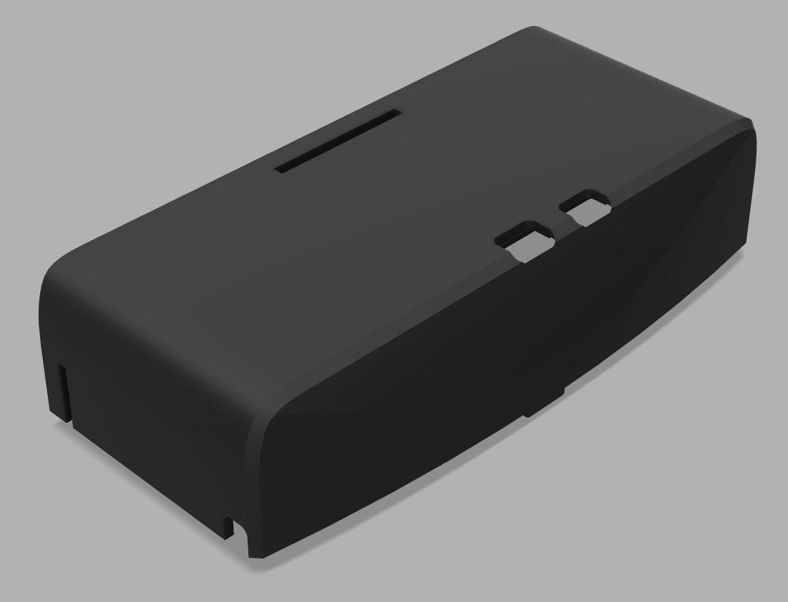
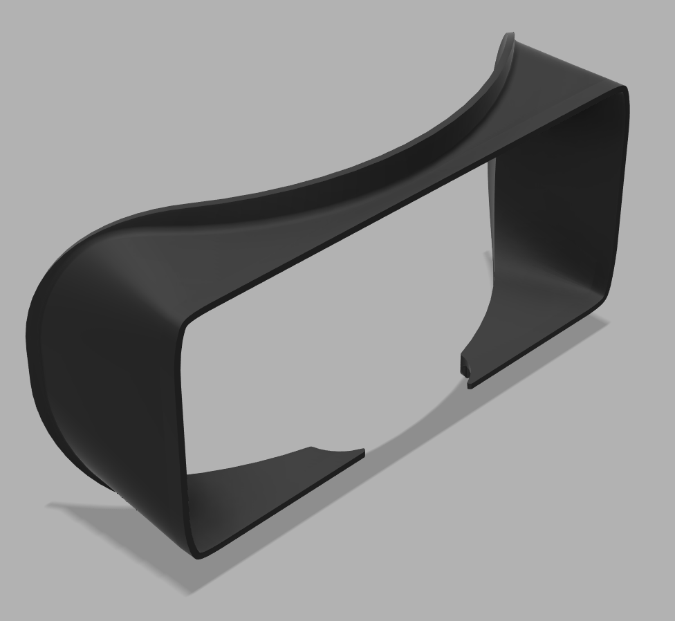
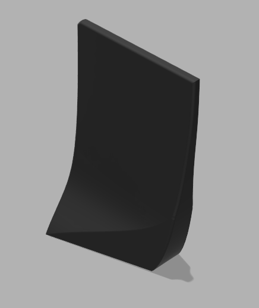
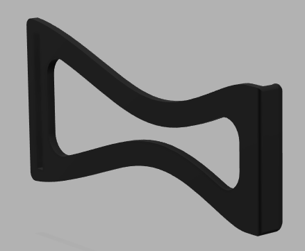
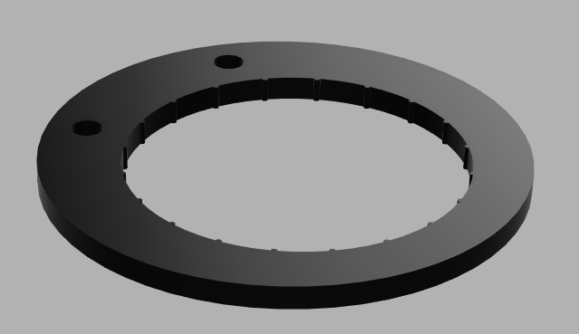
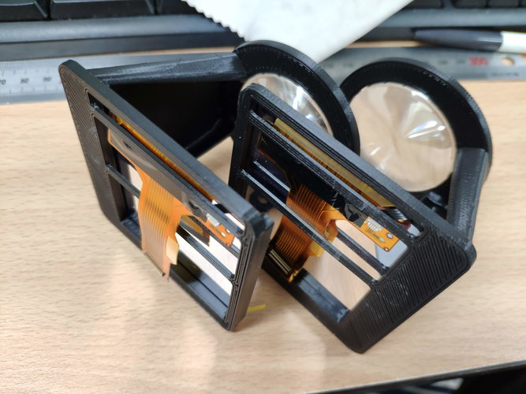

[English](./readme.md)

# Interpupillary distance (IPD) adjustable Relativty

[Relativty](https://github.com/relativty/Relativty) 互換のヘッドマウントディスプレイです。  
主に対象は研究者および開発者で、**左右独立で57～87mmの間で瞳孔間距離を調整可能です。**  
レールマウント好きの方向けに、天面にレールマウントを用意したバージョンもあります。

# 必要なもの

[Relativty](https://github.com/relativty/Relativty)と同じです。  

|                                      Component                                      | Qty |
| :---------------------------------------------------------------------------------: | :-: |
|                   Fresnel lens(Diameter:42mm, Focal length:50mm)\*                  |  2  |
|              [Strap](https://www.aliexpress.com/item/33058848848.html)              |  1  |
|           [Face foam](https://www.aliexpress.com/item/4000199486058.html)           |  1  |
| [2 LCD panels with control board](https://www.aliexpress.com/item/32975198897.html) |  1  |

\*Relativtyで紹介されていたフレネルレンズは現在売り切れですが、似たようなものはAliexpressにたくさんあるので、たぶん互換するものがあります。  

6DOFやSteamVRで使用する予定の方は、マザーボードの組み立てまで終えてください。

# 3Dプリント

モデルはFDM (熱溶解積層方式) 3Dプリンタ向けに最適化したので、**フェイスカバー以外にサポート材はおそらく必要ありません。**  
HMDはHMDを覆うカバーと左右のアイボックスで構成されます。  
下記の表に必要なモデルとその数を示します (1-3行: HMDカバー, 4-6行: アイボックス)。

|                      Model                      | Qty |     |                      Model                     | Qty |
| :---------------------------------------------: | :-: | :-: | :--------------------------------------------: | :-: |
|          Top cover         |  1  |     |      Bottom cover      |  1  |
|      Face cover      |  1  |     |    L/R separator    |  1  |
|  Side strap holder |  2  |     |  Top strap holder  |  1  |
|    Lens mounter    |  2  |     |      Eyebox pillar     |  2  |
| Right display mounter |  1  |     | Left display mounter |  1  |
|      Eyebox screw\*      |  2  |     |                                                |     |

\*アイボックス用のネジはM6ネジでも代用できます。

## レールマウントを愛する方々へ

HMDの天面がレールマウントになったモデルがあります。  
`./stl/Top.stl`の代わりに`./stl/Top_rail.stl`を印刷してください。  
レールマウント断面は以下のとおりです (単位:mm):  

# 組み立て

特殊な工具は必要ありませんが、フェイスカバーにクッションを取り付ける際、グルーガンがあれば楽です。

## アイボックス

まずはじめにLCDをマウンタに取り付けてください.  
**LCDはとても弱い部品なので力を入れすぎないよう注意してください。**  
マウンタは少し反るように曲げると、力を入れずともLCDは入ります。  
繰り返しますが、**LCDはとても弱い部品です。** 筆者に何があったかもうお分かりですね？ 

LCDを取り付けたら、ケーブルを以下のように配線することをおすすめします。  

右側のケーブルはマウンタ裏面の中心の柱で固定しないようにしてください。 
おそらく固定するとマザーボードと干渉します。

## HMD

左右のセパレータを下側カバーに取り付けた後、左右のアイボックスをアイボックス用ネジあるいはM6ネジで固定してください。  
ここからは多分もう部品を見ればわかると思います。  
もし組立方法を確認したければ、Fusion360などの3D-CADで確認してみてください。

# 注意事項

SteamVR用では[こちら](https://github.com/relativty/Relativty#installing-relativty-driver-for-steamvr)を参考におそらくディスプレイの設定を書き換える必要があります。

# にゃ～ん！

HMDの設計に関する問題ならば、このリポジトリのIssueに報告、あるいは[@TenteEEEE](https://twitter.com/tenteeeee)までご相談ください。  
ソフトウェアに関する問題のようならば[Relativty](https://github.com/relativty/Relativty) のチームに聞いたほうが早いと思います。

# ライセンス

このリポジトリは[Relativty](https://github.com/relativty/Relativty)と同じく、GNU General Public License v3.0 でライセンスされます。
